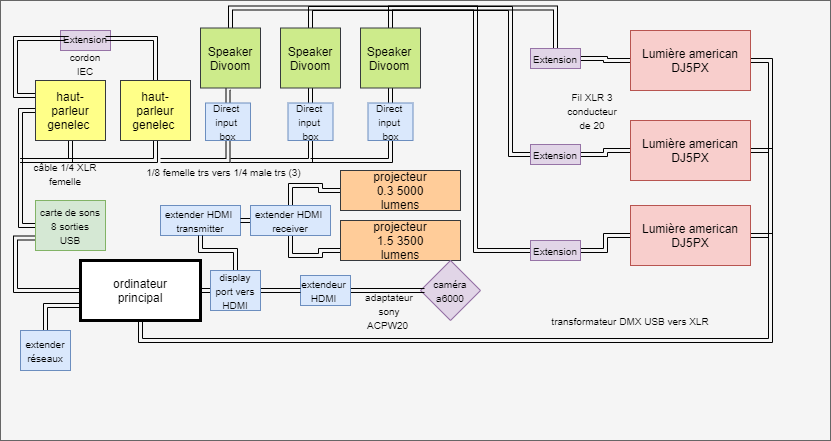
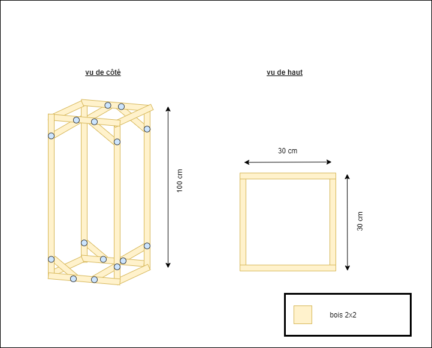

# Préproduction
> C'est ici qu'on dépose les éléments de la préproduction.

> Au besoin, se référer à l'[Appel de projet](https://cmontmorency365.sharepoint.com/:w:/s/TIM-58266B-Expriencemultimdiainteractive-Enseignants/EQ3PqvTQPzFDnpeccqWYOAgBZowMn5-3gtl0I_OxsEGC-Q?e=DuUbuG), au [Plan de cours](https://cmontmorency365.sharepoint.com/:w:/s/TIM-58266B-Expriencemultimdiainteractive-Enseignants/EWLLhctc9WZJiDCSjlMXcFoBA9fMhQRS4PHbGXHCH2Irxw?e=qGOnLf) et à la [Grille d'évaluation de la préproduction](https://cmontmorency365.sharepoint.com/:w:/s/TIM-58266B-Expriencemultimdiainteractive-Enseignants/ETcbkxD6vp1EmhhiZ3Di5_sBZwSyqisa7s3543kMy28dSg?e=gnu6Bt).

# Table des matières
1. [Intention ou concept](#Intention-ou-concept)
    - [Synopsis](#Synopsis)
    - [Intention de départ](#Intention-de-départ)
    - [Tableau d'ambiance (*moodboard*)](#Tableau-d'ambiance-(*moodboard*))
    - [Scénario, scénarimage ou document audio/visuel](#Scénario,-scénarimage-ou-document-audio/visuel)
2. [Contenu multimédia à intégrer](#Contenu-multimédia-à-intégrer)
    - [Inventaire du contenu multimédia](#Inventaire-du-contenu-multimédia)
    - [Univers artistique des éléments](#Univers-artistique-des-éléments-centraux)
3. [Planification technique (devis technique)](#Planification-technique-(devis-technique))
    - [Schémas ou plans techniques](#Schémas-ou-plans-techniques)
    - [Matériaux requis](#Matériaux-de-scénographie-requis)
    - [Équipements requis](#Équipements-requis)
    - [Logiciels requis](#Logiciels-requis)
    - [Ressources humaines requises](#Ressources-humaines-requises)
    - [Ressources spatiales requises (rangement et locaux)](#Ressources-spatiales-requises-(rangement-et-locaux))
4. [Planification de la production (budget et étapes de réalisation)](#Planification-de-la-production-(budget-et-étapes-de-réalisation))
    - [Budget prévisionnel](#Budget-prévisionnel)
    - [Échéancier global](#Échéancier-global)
    - [Liste des tâches à réaliser](#Liste-des-tâches-à-réaliser)
    - [Rôles et responsabilités des membres de l'équipe](#Rôles-et-responsabilités-des-membres-de-l'équipe))
    - [Moments des rencontres d'équipe](#Moments-des-rencontres-d'équipe)

# Intention ou concept
## Synopsis
Les Chatoyants est une projection d’animations sous le thème de chats s’affichant dans l’une des trois boîtes situées l'une à côté de l'autre et le long du mur du fond de la salle. Tout d'abord, une animation d'un chat projetée sur le mur, où sont situés les boîtes, va aléatoirement choisir parmi laquelle des trois boîtes le chat entrera. Par la suite, le spectateur sera incité à s'approcher de la boîte par des sons et lumières provenant de la boîte choisie. Aussi, les autres boîtes ne seront pas mises en évidence afin de guider le spectateur vers la boîte choisie. Dans la boîte choisie, une projection d'une animation d'un chat dans une certaine dimension, selon la boîte, sera projetée dans le fond de la dite boîte. Ce même processus se répète plusieurs fois entre les trois différentes boîtes, et ce, de façon aléatoire. Le spectateur sera guidé de la même façon (par la vidéo, la lumière et le son), mais présentera des vidéos d’animations différentes à l’intérieur des boîtes, selon la boîte choisie. Le chat ressort de la boîte lorsque la projection est terminée et choisit de nouveau une boîte dans laquelle il ira, et ce, en cycle. Le principe sera le même en ligne, cependant le spectateur pourra choisir parmi les trois personnes suivantes : Mathis, 9 ans, Jasmine, 19 ans ainsi que Jacques, 46 ans. Selon le point de vue choisi, le spectateur va pouvoir
explorer les univers différents, et ce, dans un ordre différent. Selon la personne choisie, la hauteur de la caméra va varier.

## Intention de départ
Dans ces temps difficiles, le projet des Chatoyants a pour but de rassembler à distance les gens par son aspect ludique et réconfortant, c'est-à-dire un monde imaginaire et onirique. La présence des chats permet de se distraire des différents éléments stressants de la vie réelle. Notre projet apporte une source de réconfort et un aspect rassurant dans ces temps difficiles par la présence chaleureuse des chats.

## Tableau d'ambiance (*moodboard*)
[Tableau d'ambiance visuels (images, couleurs)](medias/moodboard_projetSynthese.jpg)

## Scénario, scénarimage ou document audio/visuel
[Scénarimage visuel pour vidéo d'animation d'Alexandra](medias/scenarimage_alex.PNG)

[Scénarimage visuel pour vidéo d'animation de Catherine 1](medias/scenarimage_cath1.PNG)

[Scénarimage visuel pour vidéo d'animation de Catherine 2](medias/scenarimage_cath2.PNG)

[Scénarimage visuel pour vidéo d'animation de Steaven](medias/scenarimage_steaven.PNG)

[Scénario en présentiel](medias/chatoyants_presentiel.pdf)

[Scénario en ligne](medias/chatoyants_en_ligne.pdf)

# Contenu multimédia à intégrer
## Inventaire du contenu multimédia

- 7 paysages sonores
- 4 vidéos d'animations 2D
- 3 modules multimédias : Contrôle de vidéos, contrôle de l'éclairage et contrôle du son

> Pour plus de détails :
[Contenu à intégrer](contenu_multimédia.xlsx)

## Univers artistique des éléments

- Paysages sonores : Les paysages sonores dans notre projet mène le public vers la bonne humeur afin de s'échapper de la situation actuelle. Le son d'ambiance est plutôt neutre, il vient rappeler l'impact psychologique de la pandémie. 

Exemples de son : 
[Sons](medias/Crisp_Ocean_Waves-Mike_Koenig-1486046376.wav)

- Vidéos animations 2D : Le projet est en noir et blanc. Le blanc est utilisé pour le chat et les contours en arrière-plan, le noir est utilisé pour l'arrière-plan. Le déroulement de chaque animation : Un chat se retrouve dans une dimension (aquatique, imaginaire ou dans une chute), il parcourt la dimension et finit par se faire aspirer dans une boite pour revenir au Idle.
- Modules multimédias : Les animations seront projetées par des projecteurs. Il y aura une lumières en dessous de chaque table pour démontrer quelle animation est active dans une boite. Il y aura le contrôle du son entre la vidéo de départ (Idle) et la dimension dans lequel le chat se retrouve.

> Pour plus de détails [Voir colone Exemple de réalisation]:
[Contenu à intégrer](contenu_multimédia.xlsx)

# Planification technique (devis technique)
## Schémas ou plans techniques
> Insérer plans, documents et schémas pertinents dans cette sectio.  

### Schéma de branchement

### Schéma de fonctionnement

### Plantation 

### Plan des 3 tables

## Matériel de scénographie requis

> Liste des matériaux de scénographie (matériaux de décor) requis ou lien vers un tableur Excel ou document Markdown à part si nécessaire (quantité, spécifications techniques, lien vers fiche technique si applicable, commentaires...)

#### IMPORTANT! L'artiste fournira tous le matériels de scénographies pour le projet
* Barrette 2 x 2 x 8 MILLSTEAD SPF SDRY [choix A]
    * 2 x 2 x 8
    * Quantité [5]
* Boite [choix B]
    * 30 x 30 x 30 cm ~
    * Quantité [3]
* nape
    * 180 x 290 cm
    * Couleur blanc
    * Quantité [3]
    * Important, doivent permettre une certaine circulation d'air.
* boite
    * 20" (comme un éran) (50,8 cm), IPS, Large (16:9)
    * Quantité [3]
* Studio acrylics Titanium White PA011
    * Quantité [2]

## Équipements requis
> Liste des équipements requis pour le projet pour plus de détail téléchargez le
[Formulaire d'emprunt](formulaire_emprunt.xlsx)
* Audio
    * 2 haut-parleurs Genelec 8010 8"
    * 3 speaker Divoom Airbeat-10
    * carte de sons Berhinger U-phoria 8 in 8 out
    * 2 câbles XLR
    * 1 
    * 1 cable 1/4 XLR femelle

* Vidéo
    * 2 projecteurs standard, ratio 1.5, 3500 lumens
    * 2 systèmes d'acrochage
    * 1 caméra A6000 (difusion)
    * 1 trépieds (diffusion)
    * 1 Adaptateur Sony ACPW20 pour série a6000 (diffusion)
    * 4 câbles HDMI
    * 2 extendeur HDMI
    * 1 câble micro HDMI vers HDMI 

* Lumière
    * 3 american DJ5PX HEX LED Par can
    * 3 fils XLR 3 conducteurs de 20'
    * Transformateur DMX USB vers XLR

* Électricité
    * 2 cordon IEC (pour l'alimentation des haut-parleurs Genelec)
    * 2 multiprise (son/lumière)

* Ordinateur
    * 1 ordinateur 
    

## Logiciels requis
> Liste des logiciels requis, version ainsi que leurs dépendences

* [Illustrator 2021](https://www.adobe.com/products/illustrator.html) 
* [Max 8](https://cycling74.com/products/max)   
* [after effect 2021](https://www.adobe.com/products/aftereffects.html)
* [premiere 2021](https://www.adobe.com/products/premiere.html)
* [storyboarder 1.0.0](https://wonderunit.com/storyboarder/)
* [OBS - Open Broadcaster Software 26.1](https://obsproject.com/fr/download)

## Ressources humaines requises
> Moments et fonctions où une intervention humaine externe à l'équipe est nécessaire et pourquoi. Formaté en liste ou en lien vers un tableur Excel.

* 15 février, TTP, location de matériel 
    * Nous aurons besoin du TTP pour pouvoir faire la location de notre matériel pour le projet
* 15 février, TTP, aide à l'installation si nécessaire
    * Nous aurons très certainement besoin à certain moment d'aide pour l'installation de notre matériel. Il sera bien d'avoir   quelqu'un dans les parages si un problème survient ou simplement si nous avons une question. 
* 26 mars, TTP, retour du matériel
    * Nous aurons besoin du TTP pour nous assisté à certain moment lors faire le démontage de notre installation. De plus, nous aurons besoin du TTP pour pouvoir faire le retour de notre matériel.
## Ressources spatiales requises (rangement et locaux)
> Moments et spécifications des espaces utilisés formaté en liste ou lien vers un tableur Excel.

* Grand studio
    * 15 février
        * installation de l'équipement
        * 6 heures
    * 16 février au 25 mars
        * stockage de l'équipement et installation
        * ~ heures
    * 26 mars
        * Démontage
        * 3 heures
    

    
# Planification de la production (budget et étapes de réalisation)
## Budget prévisionnel
Revenus = 0$

Dépenses: 
- 3 nappes (environ 1$45 chacune)
- Bois pour des tables (environ 3$ chacune)
- Total = 20$

## Échéancier global
Étapes importantes du projet visualisé dans GitHub (*milestones*):  
https://github.com/samcard01/les_chatoyants/milestones

*Dates importantes de diffusion :*
- Pratique générale : 19 mars (toute la journée)
- Début de la diffusion : lundi 22 mars
- Présentation des projets devant public : jeudi 25 mars (soir)

## Liste des tâches à réaliser
Visualisation des tâches à réaliser dans GitHub selon la méthode Kanban:  
https://github.com/samcard01/les_chatoyants/projects/1

Inventaire des tâches à réaliser dans GitHub selon le répertoire d'*issues*:  
https://github.com/samcard01/les_chatoyants/issues

## Rôles et responsabilités des membres de l'équipe

**Alexandra**
- Coordination générale du projet (coordination de l'échéancier, du budget, suivi de la liste des tâches à réaliser, s'assurer de la répartition du rôle et des responsabilités des membres de l'équipe);
- Comité Diffusion et coordination de la diffusion (mise en ligne du Site Web, organisation de la plateforme et de l'événement de diffusion);
- Création des images;
- Création d'une vidéo d'animation 2D;
- Création des paysages sonores sonores;
- Installation de l'équipement dans l'espace physique.
- Installation et mise en place de la capture audiovidéo du projet en temps réel;

Liste des tâches dans Git Hub: 
https://github.com/samcard01/les_chatoyants/issues/assigned/alexmai05
https://github.com/samcard01/les_chatoyants/projects/1?card_filter_query=assignee%3Aalexmai05

**Catherine**
- Comité Technique et coordination technique (suivi du devis technique);
- Programmation du module Max de contrôle vidéo.
- Programmation du module Max d'éclairage;
- Création des images;
- Création d'une vidéo d'animation 2D;
- Création des paysages sonores;
- Installation de l'équipement dans l'espace physique.
- Installation et mise en place de la capture audiovidéo du projet en temps réel;

Liste des tâches dans Git Hub:  
https://github.com/samcard01/les_chatoyants/issues/assigned/CatherineCote
https://github.com/samcard01/les_chatoyants/projects/1?card_filter_query=assignee%3Acatherinecote

**Samuel**
- Comité Diffusion et coordination de la diffusion (mise en ligne du Site Web, organisation de la plateforme et de l'événement de diffusion);
- Programmation du module Max d'effet et de contrôle audio;
- Création des icônes de navigation (thumbnail);
- Programmation du module de diffusion et d'interaction en ligne (page Web, diffusion vidéo dans Twitch via OBS, interface utilisateur dans Open Stage Control).
- Installation de l'équipement dans l'espace physique.
- Installation et mise en place de la capture audiovidéo du projet en temps réel;

Liste des tâches dans Git Hub:  
https://github.com/samcard01/les_chatoyants/issues/assigned/samcard01
https://github.com/samcard01/les_chatoyants/projects/1?card_filter_query=assignee%3Asamcard01

**Steaven**
- Coordination artistique (attention plus particulière pour s'assurer que l'intention/concept artistique du projet initial reste, sinon consulter les membres de l'équipe);
- Comité Technique et coordination technique (suivi du devis technique);
- Création des paysages sonores sonores;
- Création des images;
- Création de deux vidéos d'animation 2D;
- Installation de l'équipement dans l'espace physique.
- Installation et mise en place de la capture audiovidéo du projet en temps réel;

Liste des tâches dans Git Hub:
https://github.com/samcard01/les_chatoyants/issues/assigned/SteavenR
https://github.com/samcard01/les_chatoyants/projects/1?card_filter_query=assignee%3Asteavenr

**Pas clair**
- Programmation du module Max de contrôle de la navigation utilisateur & des différents sous-modules.

**Tâches pas encore attribuées**  
https://github.com/samcard01/les_chatoyants/issues?q=is%3Aopen+is%3Aissue+no%3Aassignee

## Moments des rencontres d'équipe

Hebdomadaire
- **Mardi 13h (environ 2h)** : Rencontre d'équipe
- **Mardi 15h (environ 1h)** : Rencontre d'équipe avec professeur
- **Mercredi 11h (environ 1h)** : Rencontre de mise à jour d'équipe (Journal Web, suivis, mise à jour de l'échéancier, partage des tâches et autres)
- **Vendredi 9h50 (environ 2h)** : Rencontre générale de classe

Autre: 
- **Jeudi 10h (environ 1h30)** : Comité Diffusion
- **Jeudi 14h (environ 1h30)** : Comité Technique
